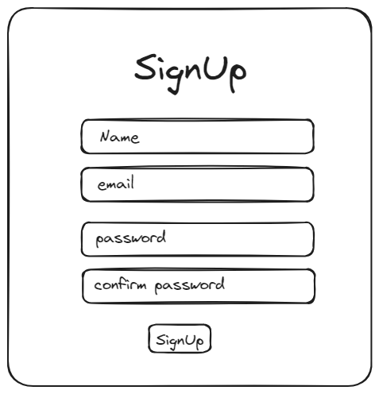

# Mini Projects Repository

Welcome to my collection of mini projects! This repository includes small, reusable components that can be easily integrated into any project. Each mini project comes with its own HTML, CSS, and JavaScript files, along with a basic design sketch using Excalidraw.

## Projects

### 1. SignUp Form

This project is a simple SignUp form that collects user information like name, email, and password. It includes validation to ensure the password fields match and that all fields are filled out correctly.

#### Files
- `index.html`
- `styles.css`
- `script.js`
- `signup_form_excalidraw.png`

#### HTML Structure
```html
<div class="form-container" id="signup">
    <h1>SignUp</h1>
    <form action="./index.html" id="signup-form">
        <input type="text" name="name" id="signup-name" placeholder="name">
        <input type="email" name="email" id="signup-email" placeholder="email">
        <input type="password" name="password" id="signup-pwd" placeholder="password">
        <input type="password" name="password" id="signup-confirm-pwd" placeholder="confirm password">
        <button id="submit-btn" type="submit">SignUp</button>
    </form>
</div>
```

#### JavaScript (script.js)
```javascript
signUpForm.addEventListener('submit', (e) => {
    e.preventDefault();
    for (const label of labels) {
        console.log(label);
        if (document.querySelector(`#${label}`).value === '') {
            alert(`${label} is invalid. Please enter correct details`);
            formStatus = -1;
            break;
        } else {
            userInput[`${label}`] = document.querySelector(`#${label}`).value;
            document.querySelector(`#${label}`).value = '';
        }
    }
})
```

#### Excalidraw Design


## Usage
1. Clone this repository:
```bash
git clone https://github.com/AdityaNath0777/miniprojects.git
```

2. Navigate to the project directory:
```bash
cd miniprojects
```

3. Open `./signUp/index.html` in your browser to see the SignUp form in action.

## Contributing
Feel free to fork this repository and contribute by submitting a pull request. For major changes, please open an issue first to discuss what you would like to change.

## License
This project is licensed under the MIT License.